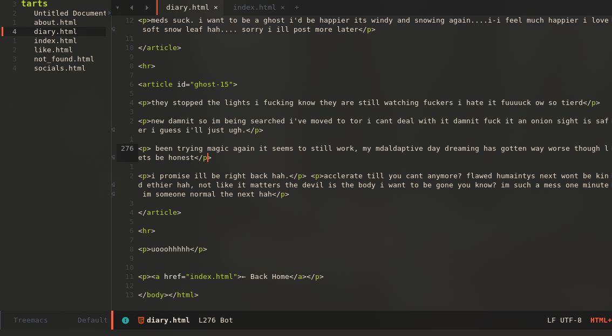

#+author: Alice Liddell
#+options: toc:nil

#+caption: screenshot emacs

* What?
This is my emacs config i use for pretty much anything. I think its decently well made, its a flake so you can use it wherever~

* Why?
... I don't know? lmfao i geuss i just wanted my own emacs config not relaint on any of the distros lol.

* How?
uh:
#+begin_src nix
    # Emacs
    nixmacs = {
      url = "git+https://codeberg.org/sheep/nixmacs";
      inputs.nixpkgs.follows = "nixpkgs";
    };
#+end_src
    
Thats how add that to your flake.nix and it should build?

* Who's Alice?
Im Alice silly goose~
